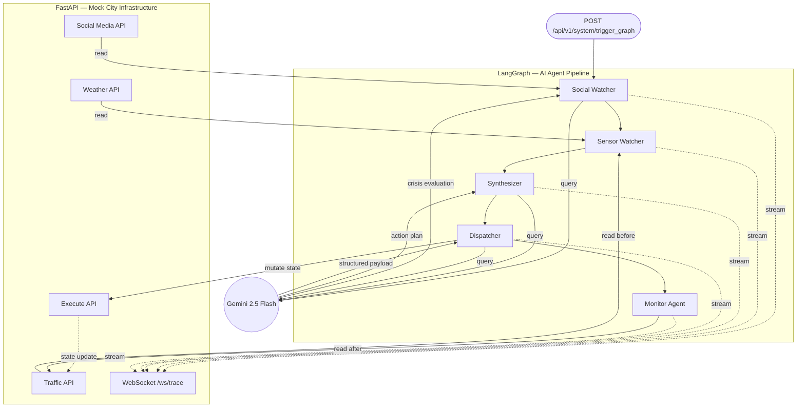

# CIRO — Crisis Infrastructure Response Operator

> Autonomous multi-agent AI system that detects urban crises, coordinates emergency response, and validates real-world impact — in real time.

Built for the **Google Antigravity Hackathon** using LangGraph, Gemini 2.5 Flash, and FastAPI.

---
 
## The Problem

Islamabad — like most metropolitan cities — faces recurring urban crises: flash floods, road blockages, infrastructure failures. The signals are always there (social media, traffic sensors, weather APIs), but response systems are fragmented, reactive, and slow to coordinate. Critical minutes are lost translating raw data into decisions.

**CIRO closes that gap.**

---

## What CIRO Does

Give CIRO a live city data feed. Within seconds, it:

1. Detects an emerging crisis from noisy, multilingual social signals
2. Cross-references it against hard sensor data to confirm ground truth
3. Generates and executes a coordinated response plan
4. Validates that the intervention actually worked — with measured numbers

No human in the loop. No single massive LLM trying to do everything. A pipeline of specialized agents, each doing one job precisely.

---

## Live Demo Flow

```
POST /api/v1/system/trigger_graph
        │
        ▼
┌─────────────────────────────────────────────────────────────┐
│                    WebSocket  /ws/trace                      │
│                                                             │
│  🕵️  Social Watcher   →  "Flood detected · G-10 · 9/10"    │
│  📡  Sensor Watcher   →  "Speed: 3.8 km/h · Congestion: 10"│
│  🧠  Synthesizer      →  "CRITICAL · Kashmir Highway"       │
│  🦾  Dispatcher       →  "Road closed · Alerts broadcast"   │
│  📊  Monitor          →  "Speed: 28.4 km/h · +647% ✅"     │
└─────────────────────────────────────────────────────────────┘
```

Every agent's reasoning streams live to the dashboard the moment it finishes. Judges and operators see the system think — not just the final answer.

---

## Architecture



### The Environment — `main.py`

A FastAPI server simulating Islamabad's city infrastructure. It serves two roles:

- **Sensors** (GET endpoints): Mock APIs for social media (`/api/v1/social`), weather (`/api/v1/weather`), and traffic (`/api/v1/traffic`)
- **Actuator** (POST endpoint): `/api/v1/system/execute` acts as the city control panel — it receives commands from the AI and physically alters city state (closing roads, broadcasting alerts, dispatching services)

City state is stateful. When CIRO closes a road, the traffic endpoint returns different data on the next poll. This is what makes closed-loop validation real.

---

### The AI Brain — `ciro_graph.py`

Powered by **LangGraph**, this is a sequential `StateGraph` where each node is a specialized agent. A shared `CIROState` object (the "clipboard") passes between agents — each one reads prior findings, adds its own, and hands it forward.

#### Node 1 — 🕵️ Social Watcher
- Pulls tweet stream from the mock social API
- Runs a fast Python keyword filter (flood, pani, accident, bijli) to discard noise before hitting the LLM — saving tokens and latency
- Sends filtered tweets to **Gemini 2.5 Flash** with structured output, returning a `CrisisEvaluation`: crisis type, location, and a 0–10 confidence score
- Handles Roman Urdu and English inputs without special handling — Gemini resolves both

#### Node 2 — 📡 Sensor Watcher
- Pulls traffic and weather API data independently of social signals
- Detects anomalies from hard metrics: average speed below threshold, congestion level, rainfall intensity
- Provides objective ground truth to prevent the system from acting on social panic alone

#### Node 3 — 🧠 Synthesizer
- Receives both `CrisisEvaluation` (social) and sensor anomaly data
- If both channels show no anomaly: graph terminates early — no compute wasted
- If signals corroborate: generates a structured `ActionPlan` — severity level (LOW / HIGH / CRITICAL), target zone coordinates, and specific recommended interventions
- This is the only node that decides whether real-world action happens

#### Node 4 — 🦾 Dispatcher
- Converts the human-readable `ActionPlan` into a strict machine-executable `ActionPayload` using Pydantic schema enforcement
- Fires a POST request to `main.py`'s `/api/v1/system/execute` endpoint — this actually mutates city state
- Pydantic ensures the LLM cannot hallucinate field names or malformed coordinates that would crash downstream systems

#### Node 5 — 📊 Monitor Agent *(Closed-Loop Validation)*
- Waits for infrastructure changes to propagate (simulated 5-second deployment window)
- Re-polls the same traffic API that the Sensor Watcher used at the start
- Computes percentage improvement in speed and congestion reduction
- Streams a validation report: before state → after state → impact score
- If improvement is below threshold, it flags the response as insufficient — the system knows when it failed

  

### Why This Architecture

| Problem | Our Solution |
|---|---|
| Single LLM doing everything → hallucinations | Specialized nodes with single responsibilities |
| LLM outputs unpredictable JSON → crashes backend | Pydantic `with_structured_output` at every schema boundary |
| No way to know if response worked | Closed-loop Monitor Agent with measured validation |
| Agents finish but nobody knows | WebSocket streams each agent's output live as it completes |
| Social panic without physical confirmation | Sensor Watcher provides independent corroboration before action |

---

## Technology Stack

| Layer | Technology |
|---|---|
| IDE & Agent Orchestration | Google Antigravity |
| AI Models | Gemini 2.5 Flash (via LangChain Google GenAI) |
| Agent Workflow | LangGraph (StateGraph) |
| Backend / API | FastAPI + asyncio |
| Real-Time Streaming | WebSockets (`/ws/trace`) |
| Schema Enforcement | Pydantic v2 |
| City Infrastructure Simulation | Stateful FastAPI mock endpoints |

---

## Setup & Running

### Prerequisites

```bash
Python 3.11+
A Google Gemini API key
```

### Installation

```bash
git clone https://github.com/your-team/ciro
cd ciro
pip install -r requirements.txt
```

### Environment Variables

Create a `.env` file in the root directory:

```env
GEMINI_API_KEY=your_key_here
```

### Run

```bash
uvicorn main:app --reload
```

The server starts at `http://localhost:8000`.

---

## API Reference

### Trigger the Agent Pipeline

```http
POST /api/v1/system/trigger_graph
```

Kicks off the full LangGraph pipeline asynchronously.

### Mock Data Endpoints

```http
GET /api/v1/social      # Returns mock tweet stream
GET /api/v1/weather     # Returns weather sensor data
GET /api/v1/traffic     # Returns current city traffic state
```

### City Control Panel

```http
POST /api/v1/system/execute
```

Receives action payloads from the Dispatcher and mutates city state.

### Live Agent Trace

```
WS ws://localhost:8000/ws/trace
```

Connect to this WebSocket to receive live JSON events as each agent completes. Each message contains the agent name, status, and structured findings.

---

## Sample WebSocket Output

```json
{"agent": "social_watcher",  "status": "complete", "crisis_type": "urban_flooding", "location": "G-10", "confidence": 9}
{"agent": "sensor_watcher",  "status": "complete", "avg_speed_kmh": 3.8, "congestion_level": 10, "anomaly": true}
{"agent": "synthesizer",     "status": "complete", "severity": "CRITICAL", "target_zone": "Kashmir Highway", "actions": ["road_closure", "emergency_broadcast"]}
{"agent": "dispatcher",      "status": "complete", "actions_executed": 2, "infrastructure_updated": true}
{"agent": "monitor",         "status": "complete", "speed_before": 3.8, "speed_after": 28.4, "improvement_pct": 647, "verdict": "EFFECTIVE"}
```

---

## Assumptions

- Social media data is simulated via a mock endpoint containing 30 realistic tweets in Roman Urdu and English
- Sensor data reflects pre-loaded synthetic snapshots calibrated to a realistic 3-hour flooding escalation window
- City infrastructure mutations are simulated — road closures update internal FastAPI state rather than calling real mapping APIs
- The 5-second Monitor Agent delay simulates real-world infrastructure propagation time

---

## Team

Built at the Google Antigravity Hackathon · Islamabad, Pakistan
